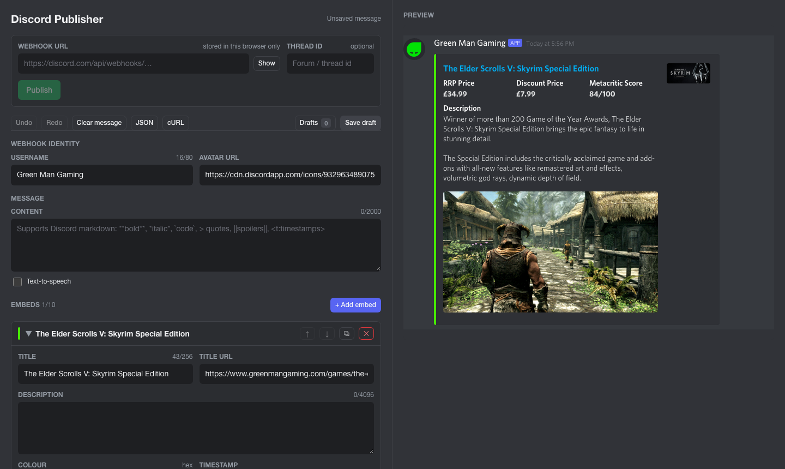

# Discord Publisher

**Compose, preview, publish and track Discord webhook messages, entirely in your browser.**

Discord Publisher is a small single-page app for people who post announcements, deals, patch notes or anything else through Discord webhooks. You build the message in a form, see exactly how Discord will render it, send it with one click, and the app remembers what you sent so you can edit or delete it later. There is no backend and no login. Everything stays in your browser.

Live site: **https://jackmcguire1.github.io/discord-publisher-vue/**



## Contents

- [Why this exists](#why-this-exists)
- [Features](#features)
- [Quick start](#quick-start)
- [How to use it](#how-to-use-it)
- [Discord limits enforced](#discord-limits-enforced)
- [Deploying](#deploying)
- [Storage and privacy](#storage-and-privacy)
- [How publishing works](#how-publishing-works)
- [Project structure](#project-structure)
- [Troubleshooting](#troubleshooting)

## Why this exists

Most embed builders are either tied to a hosted bot with accounts, premium tiers and a server-side API, or they stop at generating JSON and leave the sending to you. This project is the stripped-down middle ground: a message editor with a faithful preview, direct webhook publishing, and a lightweight drafts tracker, with nothing else attached.

It is a ground-up Vue rewrite of a fork of [Embed Generator](https://github.com/merlinfuchs/embed-generator). The React app, backend API, components, scheduling, premium features and Discord Activity integration are gone. What remains is the part that mattered: the message editor, the preview, and publishing.

The whole app is about 2,000 lines of source and four runtime dependencies: `vue`, `zod`, `simple-markdown` and `highlight.js`.

## Features

### Editing

- Webhook identity: custom **username** and **avatar URL** per message.
- **Content** with full Discord markdown and a text-to-speech toggle.
- Up to **10 embeds**, each with title, URL, description, colour, timestamp, author (name, URL, icon), image, thumbnail, footer (text, icon) and up to **25 fields** with inline layout.
- Reorder, duplicate and delete embeds and fields. Collapse embeds you are not working on.
- **Undo and redo** with Ctrl/Cmd+Z and Ctrl/Cmd+Shift+Z.
- Inline **validation** against Discord's limits with live character counters. Publishing is blocked until the message is valid.

### Preview

- Renders the message as Discord does, using Discord's own fonts and a pruned port of the discord-components stylesheet.
- Markdown support: bold, italic, underline, strikethrough, inline code, fenced code blocks with syntax highlighting, block quotes, headings, subtext, lists, spoilers, links, user/role/channel mentions, `@everyone`/`@here`, custom emoji and `<t:…>` timestamps in every format.
- Inline fields lay out in rows of three, just like Discord.

### Publishing

- Paste a webhook URL once. It is stored in your browser and masked in the UI.
- Optional **thread ID** for posting into forum posts or threads.
- **Publish** sends the message and records the returned message ID.
- **Update published** edits the message in place on Discord.
- **Delete from Discord** removes it.
- Each published message links straight to it in Discord.

### Export and import

- **JSON**: view the exact payload that will be sent, copy it, download it, paste a payload from anywhere, or import a file, then apply it back to the editor. Hex colour strings and `null` fields from other tools are handled.
- **cURL**: a ready-to-run command for sending or editing, copyable or downloadable as a shell script.

### Drafts

- Save, rename, duplicate, delete, export and import drafts.
- Publishing automatically creates a draft if you have not saved one, so every send is tracked.
- Drafts record when they were last updated and when and where they were published.
- Export one draft or all of them as JSON and import them on another machine or browser.

## Quick start

Requires Node 20 or newer and Yarn 1.

```bash
git clone https://github.com/jackmcguire1/discord-publisher-vue.git
cd discord-publisher-vue
yarn install
yarn dev
```

Open http://localhost:5173. Other scripts:

| Command          | What it does                                 |
| ---------------- | -------------------------------------------- |
| `yarn dev`       | Start the dev server with hot reload         |
| `yarn typecheck` | Run `vue-tsc` across the project             |
| `yarn build`     | Type-check, then build to `dist/`            |
| `yarn preview`   | Serve the production build locally           |

## How to use it

### 1. Get a webhook URL

In Discord, open the channel settings, go to **Integrations → Webhooks**, create one and copy its URL. It looks like `https://discord.com/api/webhooks/<id>/<token>`. Paste it into the **Webhook URL** box at the top of the editor. Treat the token like a password: anyone with the URL can post to that channel.

### 2. Build the message

Fill in the content and add embeds. The preview on the right updates as you type. Red text under a field means Discord would reject the message; the publish button stays disabled until everything is fixed.

### 3. Publish

Click **Publish**. On success you get a toast with the message ID, a green banner with a link to the message, and a draft is created automatically if you did not already have one.

### 4. Edit or delete later

Load the draft (or just stay on it), make your changes, and click **Update published**. Discord edits the original message in place. **Delete from Discord** removes it and clears the published state on the draft. Both actions require the same webhook that originally sent the message; if a different webhook is configured the buttons are disabled and the banner tells you why.

### 5. Save and move drafts around

**Save draft** stores the current message under a name. **Drafts** opens the list where you can load, rename, duplicate, export or delete them. **Export all** produces a single JSON file you can **Import** on another browser.

### Tips

- **Timestamps**: use the date picker, or click **Now**. In content, `<t:1700000000:R>` renders as relative time.
- **Colours**: use the picker or type a hex value. Clear it for Discord's default grey bar.
- **Images**: embed images and thumbnails need a direct, publicly reachable URL.
- **Keyboard**: Esc closes any modal. Undo/redo shortcuts work when focus is not inside a text field, so native text undo keeps working too.

## Discord limits enforced

| Element                        | Limit        |
| ------------------------------ | ------------ |
| Content                        | 2000 chars   |
| Username                       | 80 chars     |
| Embeds per message             | 10           |
| Embed title                    | 256 chars    |
| Embed description              | 4096 chars   |
| Fields per embed               | 25           |
| Field name                     | 256 chars    |
| Field value                    | 1024 chars   |
| Footer text                    | 2048 chars   |
| Author name                    | 256 chars    |
| Total text across one embed    | 6000 chars   |

Discord also rejects usernames containing "clyde" or "discord", and the names "everyone" and "here". The validator catches those too.

## Deploying

The repo ships a GitHub Actions workflow (`.github/workflows/deploy.yml`) that builds and deploys to GitHub Pages on every push to `main`.

One-time setup: in the repository on GitHub go to **Settings → Pages** and set **Source** to **GitHub Actions**. Push to `main` and the site appears at `https://<user>.github.io/<repo>/` after about a minute.

The production base path defaults to `/discord-publisher-vue/`. If your repository has a different name, or you use a custom domain, set `VITE_BASE`:

```bash
VITE_BASE=/ yarn build            # custom domain or user site
VITE_BASE=/my-repo/ yarn build    # different repo name
```

Because the app is static and calls Discord directly from the browser, it also works from any static host: Netlify, Vercel, Cloudflare Pages, an S3 bucket, or a folder on a local machine.

## Storage and privacy

All state lives in `localStorage` under the `discord-publisher:` prefix:

| Key        | Contents                                                        |
| ---------- | --------------------------------------------------------------- |
| `current`  | The message currently in the editor and which draft it came from |
| `drafts`   | Saved drafts, including published message references            |
| `settings` | Webhook URL and thread ID                                       |

Nothing is sent anywhere except to the Discord webhook you configure.

The webhook URL contains a secret token. It is stored only in `settings`. Drafts record the webhook **ID** and the published message ID, never the token, so exported draft files are safe to share. The cURL export does include the full webhook URL when one is set, so treat that output as sensitive.

Clearing your browser's site data removes everything. Export your drafts first if you want to keep them.

## How publishing works

The app talks to Discord's webhook endpoints directly from the browser. Discord allows cross-origin requests to these endpoints, which is what makes a backend unnecessary.

| Action  | Request                                                                 |
| ------- | ----------------------------------------------------------------------- |
| Publish | `POST /webhooks/{id}/{token}?wait=true` (and `thread_id` if set)        |
| Update  | `PATCH /webhooks/{id}/{token}/messages/{messageId}`                     |
| Delete  | `DELETE /webhooks/{id}/{token}/messages/{messageId}`                    |

`wait=true` makes Discord return the created message so its ID can be recorded. On `PATCH`, Discord ignores `username`, `avatar_url` and `tts`, so they are left out of edit payloads, and `content` plus `embeds` are always sent explicitly so that clearing them in the editor clears them on Discord too.

Before sending, the payload is cleaned: editor-only `id` fields are removed and empty strings, empty objects and empty arrays are dropped. The **JSON** modal shows the result of that cleaning, so what you see there is byte-for-byte what Discord receives.

## Project structure

```
src/
├─ discord/
│  ├─ schema.ts        Zod schema, limits, validation, payload normalisation
│  ├─ webhook.ts       URL parsing, payload building, send/edit/delete, cURL
│  └─ markdown.js      Discord markdown → HTML for the preview
├─ stores/
│  ├─ message.ts       Current message, validation, undo/redo
│  ├─ drafts.ts        Saved drafts and import/export
│  ├─ settings.ts      Webhook URL and thread ID
│  ├─ toasts.ts        Notifications
│  └─ persist.ts       localStorage helpers
├─ components/
│  ├─ MessageEditor.vue, EmbedEditor.vue, EmbedFieldEditor.vue
│  ├─ MessagePreview.vue
│  ├─ PublishPanel.vue, Toolbar.vue
│  ├─ JsonModal.vue, CurlModal.vue, DraftsModal.vue
│  └─ Field.vue, Modal.vue, Toasts.vue
├─ styles/
│  ├─ app.css          Application styling (CSS variables, dark theme)
│  └─ preview.css      Pruned discord-components stylesheet for the preview
├─ App.vue
└─ main.ts
```

There is no router, no Pinia and no UI framework. Stores are plain module-level `ref`s, which is all a single-page editor needs.

## Troubleshooting

**"Not a Discord webhook URL"**
The URL must match `https://discord.com/api/webhooks/<id>/<token>`. `discordapp.com`, `ptb.` and `canary.` hosts are accepted too. Query strings are stripped automatically.

**Publish fails with HTTP 400**
Discord rejected the payload. The toast includes Discord's error detail. Common causes are an image URL that is not publicly reachable, or a URL field that is not a real URL. The validator catches most of these before sending.

**Publish fails with HTTP 401 or 404**
The webhook was deleted in Discord, or the token is wrong. Create a new webhook and paste the new URL.

**Update or Delete buttons are disabled**
The configured webhook does not match the one that published the message. Switch back to the original webhook URL. Only the webhook that created a message can edit or delete it.

**Images show in the preview but not on Discord**
The preview loads images from your browser, which may have cookies or network access that Discord's servers do not. Use a direct, public image URL.

**I lost my drafts**
Drafts live in the browser's `localStorage` for this site. Clearing site data, using a private window or switching browsers starts from empty. Use **Export all** regularly if the drafts matter.

## Acknowledgements

The markdown parser and preview stylesheet are adapted from [Embed Generator](https://github.com/merlinfuchs/embed-generator), which in turn builds on [discord-markdown](https://github.com/brussell98/discord-markdown) and [discord-components](https://github.com/skyra-project/discord-components).
